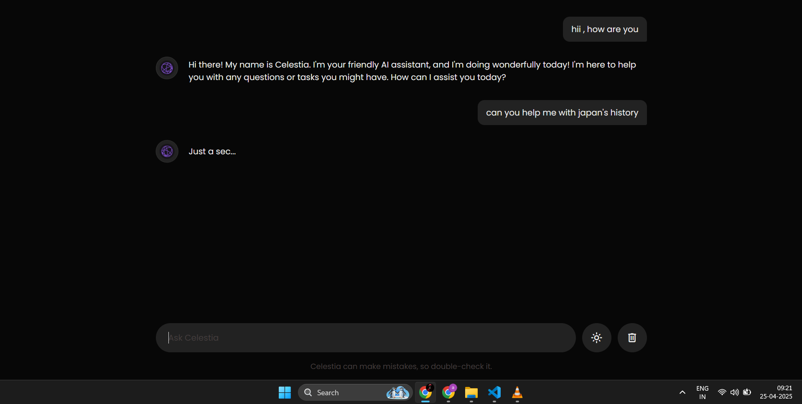
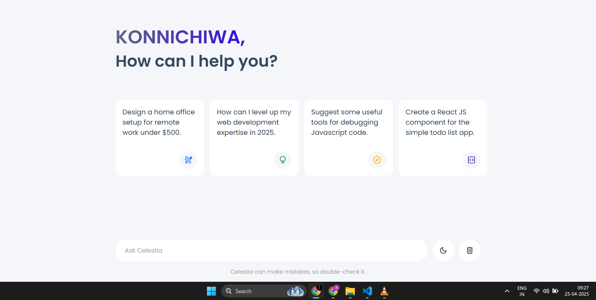

# 💬 CELESTIA | AI Chatbot

**Celestia** is a sleek, responsive, and user-friendly AI chatbot web application that utilizes Google's Gemini 1.5 Flash model to provide real-time responses to user queries. It comes with a stylish dark/light theme toggle, animated typing effect, and a suggestion-based UI for enhanced usability.

## 🚀 Features

- 💡 Real-time responses using Gemini 1.5 Flash API
- 🎨 Toggle between Dark and Light themes
- 🧠 Smart message handling & conversation history
- ✨ Typing animation for bot messages
- 📜 Preloaded suggestions to spark user queries
- 🧽 Clear chats functionality
- 📱 Fully responsive design for all devices

## 📁 Project Structure

celestia-chatbot/
├── index.html # Main HTML structure
├── style.css # Custom styles with theme support
├── script.js # Core JS logic, API call, UI handling
├── celestia.png # Bot avatar icon
└── README.md # Project documentation

## 🛠️ Technologies Used

- **HTML5** & **CSS3**
- **JavaScript (Vanilla)**
- **Google Fonts & Icons**
- **Google Gemini API (AI backend)**

## 🧑‍💻 How It Works

1. The user enters a query in the input field.
2. On submission, the app:
   - Shows the user query in the chat container
   - Sends the query to the Gemini 1.5 Flash API
   - Displays the bot's response with a smooth typing animation
3. Users can toggle themes and clear conversations at any time.

## 🔐 API Key Configuration

## 📸 **Screenshots**

### Dark Theme (S1)

### sample screenshot (S2)

### Light Theme (S3)

## 📦 **Setup Instructions**

1.Clone this repository:

git clone https://github.com/your-username/celestia-chatbot.git
cd celestia-chatbot

2.Open index.html in your browser or use a local server like Live Server in VS Code.

3.Replace the demo API key with your actual Google Gemini API key.

4.Enjoy chatting with Celestia! 🤖

## 🌐 **Live Demo**
A live demo will be available soon. Stay tuned!

## 📄 **License**
This project is open-source and available under the MIT License.

Made with ❤️ by Himanshu
